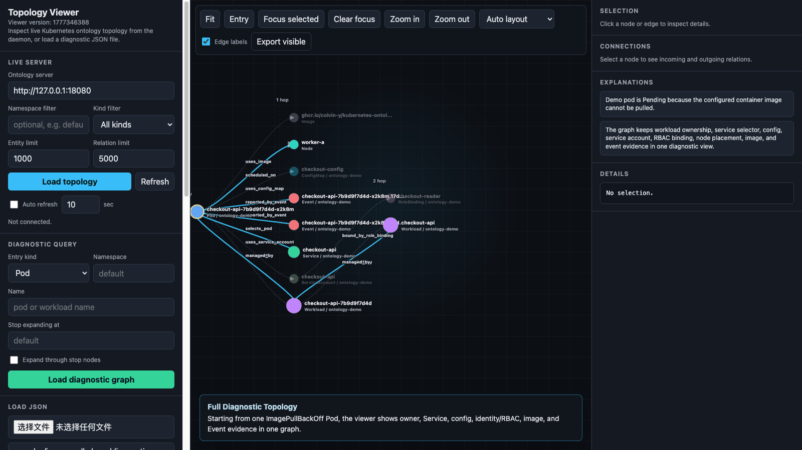

# kubernetes-ontology

[English](README.md) | [中文说明](README.zh-CN.md)

[](https://github.com/Colvin-Y/kubernetes-ontology/actions/workflows/release.yml)
[](https://github.com/Colvin-Y/kubernetes-ontology/actions/workflows/docker.yml)
[](LICENSE)

<p align="center">
  
</p>
<p align="center">
  <sub>Real topology viewer capture: a Pod diagnostic graph with workload, service, config, identity/RBAC, image, and event evidence.</sub>
</p>

`kubernetes-ontology` is a read-only Kubernetes topology service for
diagnostics, graph exploration, and AI-agent workflows.

It builds an in-memory ontology graph from Kubernetes objects, keeps the graph
fresh with informers or polling, and exposes stable CLI and HTTP queries for
entities, relations, neighbors, and diagnostic subgraphs.

The open-source MVP is intentionally lightweight:

- no controller or mutating webhook for the workloads being observed
- no runtime writes to observed Kubernetes resources
- no persistent database requirement
- no external graph backend requirement
- no CRD installation requirement

For the standard server and client workflow, start with
[QUICKSTART.md](QUICKSTART.md).

## Why This Exists

Kubernetes troubleshooting usually starts with scattered object reads:
`kubectl get pod`, then owner references, then services, events, PVCs, RBAC,
webhooks, CSI drivers, and controller pods.

This project turns those object reads into a graph:

- pods, workloads, services, nodes, storage, RBAC, events, images, and webhooks
  become typed entities
- Kubernetes references and inferred dependencies become typed relations
- diagnostic queries return a focused subgraph instead of a flat object dump
- AI agents can ask stable read-only questions without crawling the cluster
  from scratch every time

## Current Capabilities

### Diagnostic Entrypoints

- `Pod`
- `Workload`

### Runtime

- full bootstrap snapshot from the Kubernetes API
- long-running daemon with runtime status
- informer-first continuous refresh with polling fallback
- bounded CLI observe mode
- category-aware change planning
- scoped graph mutation for common update categories

Current narrow strategies:

- `service-narrow`
- `event-narrow`
- `storage-narrow`
- `identity/security-narrow`
- `pod-narrow`
- `workload-narrow`

Unsupported categories fall back to a full rebuild.

### Graph Recovery

The graph can recover and correlate:

- recursive owner chains, including `Pod -> ReplicaSet -> Deployment`
- custom workload resources configured from CRDs, such as Kruise ASTS or Redis
  clusters
- display-only controller ownership rules for controller pods that Kubernetes
  does not expose through owner references
- service selector matches
- pod to node placement
- pod to Secret, ConfigMap, ServiceAccount, image, PVC, PV, StorageClass, and
  CSI driver paths
- ServiceAccount to RoleBinding and ClusterRoleBinding evidence
- Kubernetes Event and admission webhook evidence
- PV CSI metadata

### CSI Correlation

CSI storage topology follows `PVC -> PV/StorageClass -> CSIDriver`. Component
correlation is configured with `csiComponentRules`; driver-specific controller
and node-agent inference is not enabled unless a matching rule is configured.

Recovered evidence can include relations such as:

- `provisioned_by_csi_driver`
- `implemented_by_csi_controller`
- `implemented_by_csi_node_agent`
- `managed_by_csi_controller`
- `served_by_csi_node_agent`

## Agent Onboarding

This repository provides a Codex-style skill:
[`skills/kubernetes-ontology-access`](skills/kubernetes-ontology-access/SKILL.md).
Install it directly from GitHub when you want an AI agent to guide the whole
onboarding flow instead of reading the docs manually. Users do not need to
clone this repository before installing the skill.

```bash
npx skills add https://github.com/Colvin-Y/kubernetes-ontology/tree/main/skills/kubernetes-ontology-access -g --agent codex
```

You can also install from the repository root and select the skill by name:

```bash
npx skills add Colvin-Y/kubernetes-ontology -s kubernetes-ontology-access -g --agent codex
```

Restart Codex after installing the skill, then ask for a guided setup, for
example:

```text
Use the kubernetes-ontology-access skill to onboard my cluster with Helm,
install the CLI, run a Pod diagnostic query, and open the viewer path.
```

The skill connects the three intended access modes:

- AI-agent automatic troubleshooting with daemon-backed diagnostic subgraphs.
- CLI queries for status, entity resolution, relations, neighbors, expansion,
  and Pod/Workload diagnosis.
- Human visual inspection through the topology viewer and exported graph JSON.

Agent implementers should also read [AI_CONTRACT.md](AI_CONTRACT.md) for the
diagnostic subgraph contract and safe downstream reasoning rules.

## Safety Model

`kubernetes-ontology` is read-only with respect to the Kubernetes resources it
observes.

At runtime, the daemon does not:

- create, patch, update, or delete observed Kubernetes resources
- write annotations or status fields
- install CRDs or controllers for observed workloads
- mutate RBAC policy in the observed cluster

There are three deployment modes:

- Source/local mode uses your kubeconfig and performs read-only Kubernetes API
  calls.
- Release binary mode uses the published archive to run `kubernetes-ontologyd`
  on your workstation or a bastion host. It creates no Kubernetes resources and
  only needs network access from that host to the Kubernetes API server.
- Helm mode installs this project's own Deployment, Service, ServiceAccount,
  ConfigMap, and read-only RBAC so the daemon and viewer can run in-cluster.
  That install-time footprint is expected. The granted RBAC is limited to
  `get`, `list`, and `watch` for collected resources. Secret reads are enabled
  by default so Secret nodes and `uses_secret` edges can be collected; set
  `rbac.readSecrets=false` to disable them.

The HTTP API is intended for local or controlled environments, not public
multi-tenant exposure.

## Installation

### Option 1: Release Binary Server + Client

Use this path when the target cluster is private, air-gapped, or cannot pull
the published GHCR image. The release archive includes the server
`kubernetes-ontologyd`, the CLI client `kubernetes-ontology`, and the optional
viewer `kubernetes-ontology-viewer`.

```bash
export KO_VERSION=v0.1.4
curl -LO "https://github.com/Colvin-Y/kubernetes-ontology/releases/download/${KO_VERSION}/kubernetes-ontology_${KO_VERSION}_linux_amd64.tar.gz"
tar -xzf "kubernetes-ontology_${KO_VERSION}_linux_amd64.tar.gz"
cd "kubernetes-ontology_${KO_VERSION}_linux_amd64"
```

Create `kubernetes-ontology.yaml` with a kubeconfig path and collection scope:

```yaml
kubeconfig: /absolute/path/to/kubeconfig.yaml
cluster: your-logical-cluster
contextNamespaces:
  - default
  - kube-system
server:
  addr: 127.0.0.1:18080
bootstrapTimeout: 2m
streamMode: informer
```

Start the server:

```bash
./kubernetes-ontologyd --config ./kubernetes-ontology.yaml
```

Query it from another terminal:

```bash
./kubernetes-ontology --server "http://127.0.0.1:18080" --status
```

This mode starts only host-local processes. Stop foreground server or viewer
processes with `Ctrl-C`; if you background them, store the PID and `kill` it
when the diagnostic session ends.

### Option 2: Helm + Release CLI

Use this path when you want to run the server in Kubernetes without compiling
from source and cluster nodes can pull the configured image. For private
clusters, mirror `ghcr.io/colvin-y/kubernetes-ontology` to an internal registry
and set `KO_IMAGE` to that mirror, or use the release binary path above.

```bash
export KO_VERSION=v0.1.4
export KO_IMAGE=ghcr.io/colvin-y/kubernetes-ontology

helm upgrade --install kubernetes-ontology ./charts/kubernetes-ontology \
  --namespace kubernetes-ontology \
  --create-namespace \
  --set image.repository="${KO_IMAGE}" \
  --set image.tag="${KO_VERSION}" \
  --set cluster="your-logical-cluster" \
  --set contextNamespaces='{default,kube-system}'
```

Expose the server locally:

```bash
kubectl -n kubernetes-ontology port-forward svc/kubernetes-ontology 18080:18080
```

Download the `kubernetes-ontology` CLI from
[GitHub Releases](https://github.com/Colvin-Y/kubernetes-ontology/releases),
or set `KO_VERSION` to the release tag you want to install, then query the
server:

```bash
kubernetes-ontology --server "http://127.0.0.1:18080" --status
```

The Helm chart creates the project Deployment, Service, ServiceAccount,
ConfigMap, and read-only RBAC required to run in-cluster. It also deploys the
topology viewer by default:

```bash
kubectl -n kubernetes-ontology port-forward svc/kubernetes-ontology-viewer 8765:8765
```

Open `http://127.0.0.1:8765`.

Stop short-lived `kubectl port-forward` processes with `Ctrl-C`. Remove the
in-cluster footprint with:

```bash
helm uninstall kubernetes-ontology --namespace kubernetes-ontology
```

### Option 3: Run From Source

Use this path for local development or when you want to run the daemon from your
workstation.

```bash
make build
cp local/kubernetes-ontology.yaml.example local/kubernetes-ontology.yaml
```

Edit `local/kubernetes-ontology.yaml`, then start the daemon:

```bash
make serve
```

In another terminal:

```bash
make status-server
make list-entities-server ENTITY_KIND=Pod NAMESPACE=default LIMIT=20
```

See [QUICKSTART.md](QUICKSTART.md) for the full walkthrough.

## Configuration

YAML config is the recommended way to keep cluster-specific settings:

```yaml
kubeconfig: /absolute/path/to/kubeconfig.yaml
cluster: your-logical-cluster
namespace: default
contextNamespaces:
  - default
  - kube-system

server:
  addr: 127.0.0.1:18080
  url: http://127.0.0.1:18080
bootstrapTimeout: 2m
streamMode: informer
pollInterval: 5s
```

Custom workload resources and display-only controller rules are optional:

```yaml
workloadResources:
  - group: apps.kruise.io
    version: v1beta1
    resource: statefulsets
    kind: StatefulSet
    namespaced: true

controllerRules:
  - apiVersion: apps.kruise.io/*
    kind: "*"
    namespace: kruise-system
    controllerPodPrefixes:
      - kruise-controller-manager
    nodeDaemonPodPrefixes:
      - kruise-daemon

csiComponentRules:
  - driver: diskplugin.csi.alibabacloud.com
    namespace: kube-system
    controllerPodPrefixes:
      - csi-provisioner-
    nodeAgentPodPrefixes:
      - csi-plugin-
```

If a configured custom resource is not installed in the cluster, the daemon logs
the missing resource and skips that informer. This is expected on a clean kind
cluster that does not have OpenKruise, Redis operators, or similar CRDs
installed.

More detail: [local/README.md](local/README.md).

## CLI Examples

Query daemon status:

```bash
./bin/kubernetes-ontology --server "http://127.0.0.1:18080" --status
```

Resolve a pod entity:

```bash
./bin/kubernetes-ontology \
  --server "http://127.0.0.1:18080" \
  --resolve-entity \
  --entity-kind Pod \
  --namespace default \
  --name my-pod
```

Diagnose a pod:

```bash
./bin/kubernetes-ontology \
  --server "http://127.0.0.1:18080" \
  --diagnose-pod \
  --namespace default \
  --name my-pod
```

Expand one graph node:

```bash
./bin/kubernetes-ontology \
  --server "http://127.0.0.1:18080" \
  --expand-entity \
  --entity-id 'your/entityGlobalId' \
  --expand-depth 1 \
  --limit 100
```

List filtered relations:

```bash
./bin/kubernetes-ontology \
  --server "http://127.0.0.1:18080" \
  --list-filtered-relations \
  --from 'your/entityGlobalId' \
  --relation-kind scheduled_on \
  --limit 50
```

For machine-readable server query failures:

```bash
./bin/kubernetes-ontology \
  --server "http://127.0.0.1:18080" \
  --machine-errors \
  --resolve-entity \
  --entity-kind Pod \
  --namespace default \
  --name missing-pod
```

## HTTP API

The daemon exposes the current in-memory ontology database over HTTP:

- `GET /healthz`
- `GET /status`
- `GET /entity?entityGlobalId=...`
- `GET /entity?kind=Pod&namespace=default&name=my-pod`
- `GET /entities?kind=Pod&namespace=default&limit=50`
- `GET /relations?from=...&kind=scheduled_on`
- `GET /neighbors?entityGlobalId=...&direction=out`
- `GET /expand?entityGlobalId=...&depth=1`
- `GET /diagnostic/pod?namespace=default&name=my-pod`
- `GET /diagnostic/workload?namespace=default&name=my-deployment`

Graph and list responses include additive `freshness` metadata when daemon
runtime status is available. Error responses include `code`, `message`,
`status`, `retryable`, and `source` alongside the historical `error` string.

## Visualization

The repository includes a local topology viewer:

- `kubernetes-ontology-viewer`, a release binary with embedded static assets
- `tools/visualize/server.py`, a development server
- `tools/visualize/index.html`, the browser UI

Start the daemon first:

```bash
make serve
```

Start the viewer:

```bash
make visualize
```

Open `http://127.0.0.1:8765`.

The viewer can load live topology, query focused diagnostic graphs, expand and
collapse nodes, filter by node or relation metadata, inspect provenance, and
export the visible subgraph as JSON.

## Architecture

Core layers:

- `internal/collect/k8s`: read-only Kubernetes collection, informers, and
  polling fallback
- `internal/runtime`: bootstrap, lifecycle, status, and stream application
- `internal/ontology`: entity and relation storage abstraction
- `internal/server`: HTTP API for status, ontology queries, and diagnostics
- `internal/reconcile`: full rebuild and scoped mutation reconcilers
- `internal/graph`: graph builder, kernel, and index
- `internal/query`: query facade
- `internal/service/diagnostic`: diagnostic subgraph query implementation
- `tools/visualize`: local graph viewer

Owner-chain recovery prefers controller owner references, resolves by UID first,
falls back to namespace/kind/name, guards against cycles, and supports deeper
chains beyond `Pod -> ReplicaSet -> Deployment`.

## Development

Build:

```bash
make build
```

Run tests:

```bash
make test
```

`make test` runs:

```bash
go test -p 1 ./...
```

After code changes that touch the daemon or viewer, use the fixed local
verification flow:

```bash
make verify
make serve
make visualize
make live-check NAMESPACE=default NAME=my-pod
```

## Release Publishing

Tagged releases publish:

- per-platform archives containing `kubernetes-ontology`, `kubernetes-ontologyd`,
  `kubernetes-ontology-viewer`, Quickstart docs, and a local config example
- a multi-architecture image at
  `ghcr.io/colvin-y/kubernetes-ontology:<tag>`
- SemVer aliases without the leading `v`, plus `latest`

See [docs/release.md](docs/release.md) for the release checklist.

## Known Limitations

- Graph state is in memory only.
- HTTP auth and TLS are not implemented yet.
- Persistent graph backends and external graph adapters are outside the
  open-source MVP.
- RBAC topology is represented for ServiceAccount subjects and binding objects;
  it is not a full permission reasoning engine.
- Evidence ranking is basic.
- RDF/OWL materialization is not implemented.

## Roadmap

1. Extend informer and scoped-reconcile coverage for more topology categories.
2. Add HTTP auth/TLS and longer daemon soak tests.
3. Improve diagnostic evidence ranking for downstream AI agents.
4. Broaden RBAC interpretation without turning the MVP into a full authorization
   engine.
5. Keep persistent stores and external graph adapters as post-MVP research.

## Documentation

- [QUICKSTART.md](QUICKSTART.md): full setup and query walkthrough
- [README.zh-CN.md](README.zh-CN.md): Chinese overview and usage notes
- [AI_CONTRACT.md](AI_CONTRACT.md): contract for AI-agent consumers
- [skills/kubernetes-ontology-access](skills/kubernetes-ontology-access/SKILL.md):
  project-local skill for Helm, CLI, AI-agent, and viewer onboarding
- [docs/design/README.md](docs/design/README.md): design document index
- [docs/ontology/README.md](docs/ontology/README.md): ontology notes
- [docs/release.md](docs/release.md): release checklist

## License

Licensed under the Apache License, Version 2.0. See [LICENSE](LICENSE).
