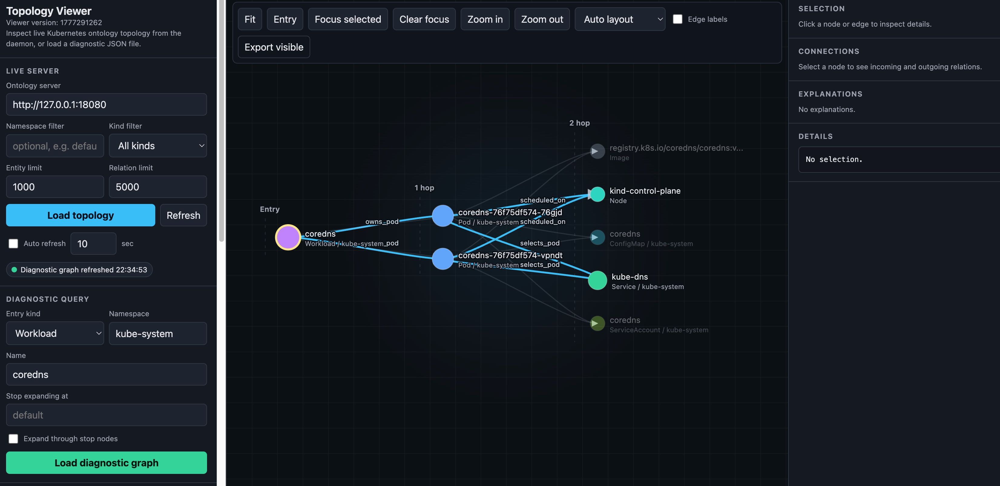

# kubernetes-ontology 中文说明

[English](README.md) | [中文说明](README.zh-CN.md)

<p align="center">
  
</p>

`kubernetes-ontology` 是一个只读的 Kubernetes 拓扑和诊断服务。它从
Kubernetes API 读取对象，在内存中构建实体和关系图，并通过 CLI、HTTP API
和本地可视化页面提供查询能力。

这个项目面向两类使用场景：

- 人类排障：快速看到 Pod、Workload、Service、Node、PVC、PV、StorageClass、
  CSI、RBAC、Event、Webhook 等对象之间的关系。
- AI Agent：通过稳定、只读、结构化的接口查询集群拓扑，而不是每次都从零散
  的 `kubectl` 命令开始推理。

当前开源版本是 MVP，定位是只读、轻量的诊断底座。

## 安全模型

`kubernetes-ontology` 对被观测的 Kubernetes 资源是只读的。

daemon 运行时不会：

- 创建、patch、update 或 delete 被观测的 Kubernetes 资源
- 写 annotation 或 status 字段
- 为被观测的 workload 安装 CRD 或 controller
- 修改被观测集群里的 RBAC 策略

项目有两种部署方式：

- 本地源码模式使用你的 kubeconfig，只发起只读 Kubernetes API 调用。
- Helm 模式会安装本项目自己的 Deployment、Service、ServiceAccount、
  ConfigMap 和只读 RBAC，让 daemon 和 viewer 能在集群内运行。这些是安装阶段
  的预期资源。chart 授予的 RBAC 只包含对采集资源的 `get`、`list`、
  `watch` 权限；Secret 读取默认关闭，只有设置 `rbac.readSecrets=true` 才会
  开启。

HTTP API 建议只暴露在本机或受控内网环境中，不要直接作为公网多租户服务使用。

## 核心能力

当前支持的诊断入口：

- `Pod`
- `Workload`

可以恢复和展示的关系包括：

- `Pod -> ReplicaSet -> Deployment` 等 ownerReference 链路
- 自定义 workload 资源，例如 OpenKruise ASTS、Redis Cluster 等 CRD 对象
- Service selector 到 Pod 的匹配关系
- Pod 到 Node、Secret、ConfigMap、ServiceAccount、Image、PVC 的关系
- PVC、PV、StorageClass、CSI Driver 的存储链路
- ServiceAccount 到 RoleBinding、ClusterRoleBinding 的证据
- Kubernetes Event 和 Admission Webhook 证据
- 部分 CSI 控制面和节点代理的推断关系

运行时支持：

- 启动时全量快照
- daemon 常驻服务
- informer 优先的增量刷新
- informer 失败时回退到 polling
- 面向常见变更类别的局部图更新

## 快速开始

完整步骤见 [QUICKSTART.md](QUICKSTART.md)。如果只想先跑起来，可以选择下面
两种方式之一。

### 方式一：Helm + Release CLI

适合不想本地编译的用户。服务端运行在 Kubernetes 集群内，本机通过
`kubectl port-forward` 访问。

```bash
export KO_VERSION=v0.1.1
export KO_IMAGE=ghcr.io/colvin-y/kubernetes-ontology

helm upgrade --install kubernetes-ontology ./charts/kubernetes-ontology \
  --namespace kubernetes-ontology \
  --create-namespace \
  --set image.repository="${KO_IMAGE}" \
  --set image.tag="${KO_VERSION}" \
  --set cluster="your-logical-cluster" \
  --set contextNamespaces='{default,kube-system}'
```

暴露服务：

```bash
kubectl -n kubernetes-ontology port-forward svc/kubernetes-ontology 18080:18080
```

从 [GitHub Releases](https://github.com/Colvin-Y/kubernetes-ontology/releases)
下载 `kubernetes-ontology` CLI。你也可以把 `KO_VERSION` 改成想安装的
release tag，然后查询状态：

```bash
kubernetes-ontology --server "http://127.0.0.1:18080" --status
```

### 方式二：从源码运行

适合本地开发或调试。

```bash
make build
cp local/kubernetes-ontology.yaml.example local/kubernetes-ontology.yaml
```

编辑 `local/kubernetes-ontology.yaml` 后启动服务：

```bash
make serve
```

另开一个终端查询：

```bash
make status-server
make list-entities-server ENTITY_KIND=Pod NAMESPACE=default LIMIT=20
```

## 配置说明

推荐使用 YAML 保存本机和集群相关配置：

```yaml
kubeconfig: /absolute/path/to/kubeconfig.yaml
cluster: your-logical-cluster
namespace: default
contextNamespaces:
  - default
  - kube-system

server:
  addr: 127.0.0.1:18080
  url: http://127.0.0.1:18080
bootstrapTimeout: 2m
streamMode: informer
pollInterval: 5s
```

`contextNamespaces` 是服务端采集范围。空列表表示采集所有 namespace。

可以配置 CRD 类 workload，让 ownerReference 链路能穿过自定义资源：

```yaml
workloadResources:
  - group: apps.kruise.io
    version: v1beta1
    resource: statefulsets
    kind: StatefulSet
    namespaced: true
```

如果配置中写了 OpenKruise、Redis operator 等 CRD，但当前集群没有安装这些
CRD，服务端只会打印日志并跳过对应 informer。比如一个纯净的 kind 集群没有
OpenKruise，这是正常情况，不需要为此中断启动。

更多配置说明见 [local/README.md](local/README.md)。

## 常用查询

查询服务状态：

```bash
./bin/kubernetes-ontology --server "http://127.0.0.1:18080" --status
```

解析一个 Pod 实体：

```bash
./bin/kubernetes-ontology \
  --server "http://127.0.0.1:18080" \
  --resolve-entity \
  --entity-kind Pod \
  --namespace default \
  --name my-pod
```

诊断一个 Pod：

```bash
./bin/kubernetes-ontology \
  --server "http://127.0.0.1:18080" \
  --diagnose-pod \
  --namespace default \
  --name my-pod
```

展开一个图节点：

```bash
./bin/kubernetes-ontology \
  --server "http://127.0.0.1:18080" \
  --expand-entity \
  --entity-id 'your/entityGlobalId' \
  --expand-depth 1
```

## HTTP API

daemon 暴露只读 HTTP API：

- `GET /healthz`
- `GET /status`
- `GET /entity?entityGlobalId=...`
- `GET /entity?kind=Pod&namespace=default&name=my-pod`
- `GET /entities?kind=Pod&namespace=default&limit=50`
- `GET /relations?from=...&kind=scheduled_on`
- `GET /neighbors?entityGlobalId=...&direction=out`
- `GET /expand?entityGlobalId=...&depth=1`
- `GET /diagnostic/pod?namespace=default&name=my-pod`
- `GET /diagnostic/workload?namespace=default&name=my-deployment`

返回结果会尽量带上 `freshness` 元数据，帮助调用方判断图数据是否 ready、最后
一次刷新是什么时候。

## 可视化

本地拓扑 viewer 可以展示 live topology、诊断子图、节点详情、边来源和导出
JSON。

启动 daemon 后运行：

```bash
make visualize
```

打开：

```text
http://127.0.0.1:8765
```

Helm chart 会创建本项目运行所需的 Deployment、Service、ServiceAccount、
ConfigMap 和只读 RBAC，并默认部署 viewer：

```bash
kubectl -n kubernetes-ontology port-forward svc/kubernetes-ontology-viewer 8765:8765
```

## 开发和验证

构建：

```bash
make build
```

测试：

```bash
make test
```

涉及 daemon 或 viewer 的变更，建议跑完整本地验证：

```bash
make verify
make serve
make visualize
make live-check NAMESPACE=default NAME=my-pod
```

## 当前限制

- 图状态只保存在内存中，daemon 重启后会从 Kubernetes API 重新构建。
- HTTP API 暂未实现认证和 TLS。
- 持久化图数据库、外部图后端、RDF/OWL 物化不在当前 MVP 范围内。
- RBAC 目前用于展示 ServiceAccount 和 Binding 证据，不是完整权限推理引擎。
- 诊断证据排序仍然比较基础。

## 更多文档

- [QUICKSTART.md](QUICKSTART.md)：完整启动和查询流程
- [AI_CONTRACT.md](AI_CONTRACT.md)：AI Agent 使用约定
- [docs/design/README.md](docs/design/README.md)：设计文档索引
- [docs/ontology/README.md](docs/ontology/README.md)：ontology 说明
- [docs/release.md](docs/release.md)：发布流程

## License

Apache License 2.0。详见 [LICENSE](LICENSE)。
