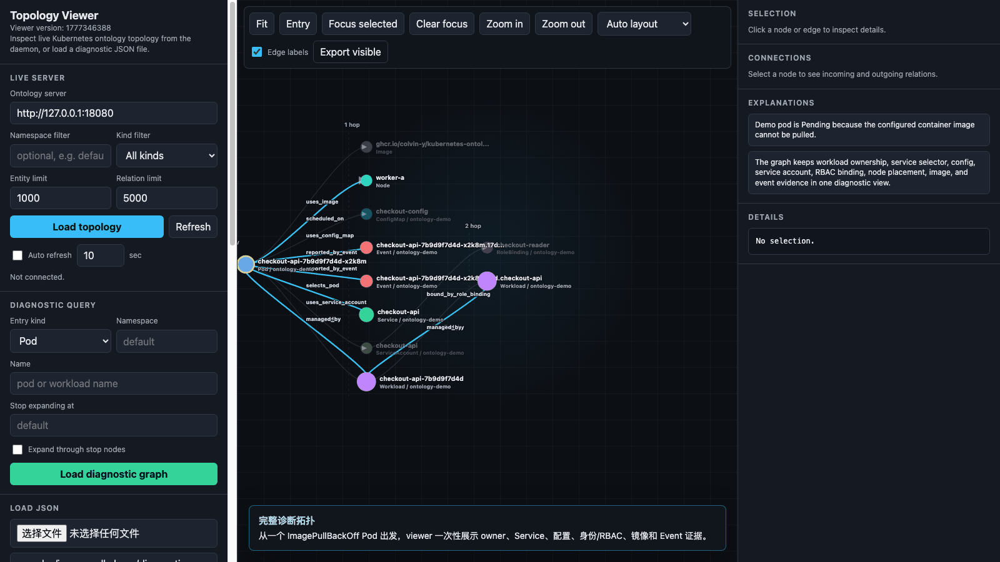

# ImagePullBackOff 诊断 Demo

这个 demo 用一个合成的 `checkout-api` Deployment 展示
`kubernetes-ontology` 的核心价值：把 Kubernetes 排障时分散在多个对象里的
证据组织成一张可查询、可视化、可交给 AI Agent 消费的关系图。

demo 中的镜像 tag 故意不存在，所以 Pod 会进入 `ImagePullBackOff`。样例只使用
`ontology-demo` namespace 下的合成资源，不包含真实集群名称、业务名或镜像地址。



## 先看离线图

如果只想快速看效果，不需要 Kubernetes 集群。启动 viewer：

```bash
make visualize
```

浏览器打开：

```text
http://127.0.0.1:8765/?file=samples/image-pull-demo/diagnostic-graph.json
```

这个离线图包含下面这些关系：

- `Deployment -> ReplicaSet -> Pod` 的 owner 链路
- `Service -> Pod` 的 selector 匹配
- `Pod -> Node` 的调度关系
- `Pod -> ConfigMap` 的配置依赖
- `Pod -> ServiceAccount -> RoleBinding` 的身份和 RBAC 证据
- `Pod -> Image` 的镜像依赖
- `Event -> Pod` 的失败事件证据

如果需要重新生成上面的 GIF，会启动本地 viewer 和 Chrome headless，从真实页面截图。
默认生成中文版，英文版可通过 `CAPTURE_LOCALE=en` 生成：

```bash
node samples/image-pull-demo/capture_viewer_gif.mjs
CAPTURE_LOCALE=en node samples/image-pull-demo/capture_viewer_gif.mjs
```

## 在测试集群里复现

准备一个可访问的测试集群，然后创建 demo 资源：

```bash
kubectl apply -f samples/image-pull-demo/manifests.yaml
```

等待 Pod 进入拉镜像失败状态：

```bash
kubectl -n ontology-demo get pod -l app.kubernetes.io/name=checkout-api
kubectl -n ontology-demo describe pod -l app.kubernetes.io/name=checkout-api
```

启动 `kubernetes-ontologyd`。如果使用源码方式，先按
[QUICKSTART.md](../../QUICKSTART.md) 配好 `local/kubernetes-ontology.yaml`，
并把采集范围包含 `ontology-demo`：

```yaml
namespace: ontology-demo
contextNamespaces:
  - ontology-demo
```

然后启动服务端：

```bash
make serve
```

另开一个终端查询诊断图：

```bash
POD="$(kubectl -n ontology-demo get pod -l app.kubernetes.io/name=checkout-api -o jsonpath='{.items[0].metadata.name}')"

./bin/kubernetes-ontology \
  --server "http://127.0.0.1:18080" \
  --diagnose-pod \
  --namespace ontology-demo \
  --name "${POD}"
```

打开可视化页面：

```bash
make visualize
```

在页面的 Diagnostic 区域选择：

- Entry kind: `Pod`
- Namespace: `ontology-demo`
- Name: 上面查到的 Pod 名称

点击 `Load diagnostic graph` 后，可以看到失败 Pod 周围的工作负载、Service、
ConfigMap、ServiceAccount、RoleBinding、Image、Event 等证据。

清理资源：

```bash
kubectl delete -f samples/image-pull-demo/manifests.yaml
```
